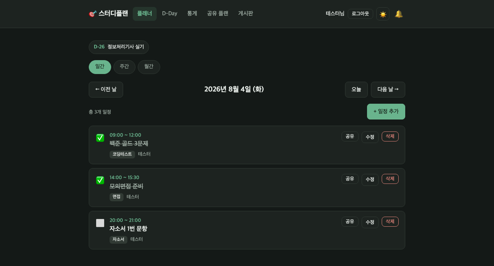
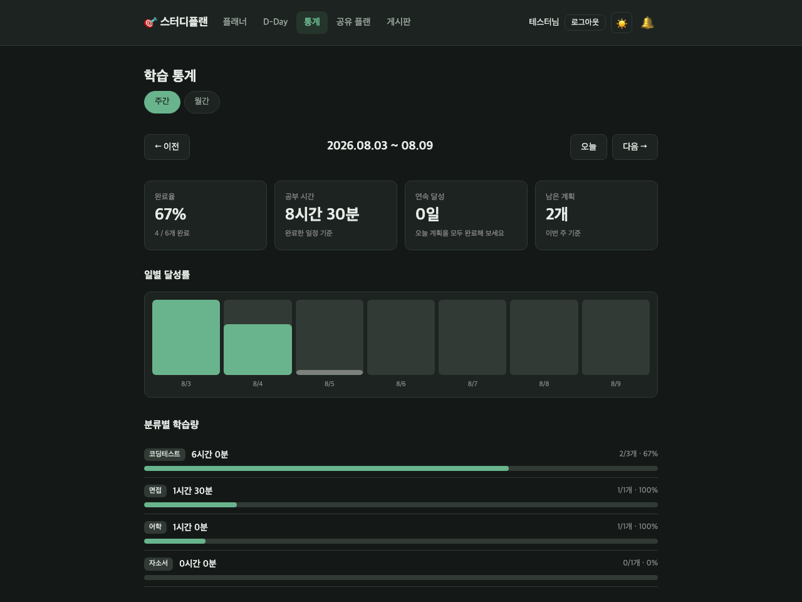
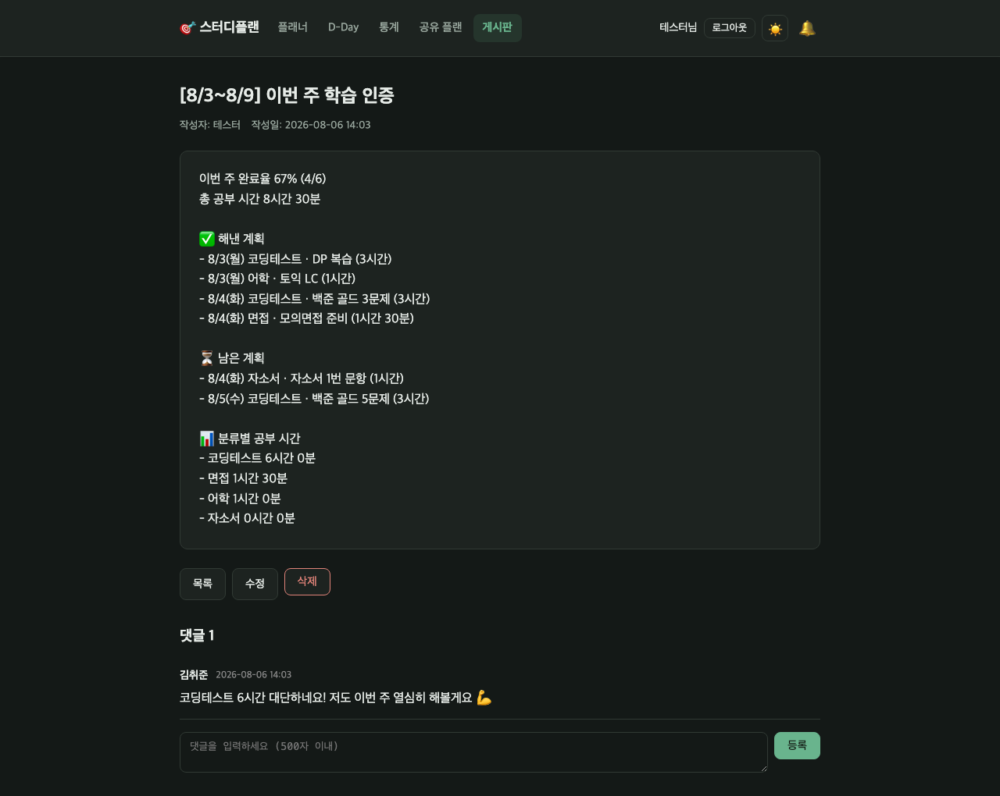
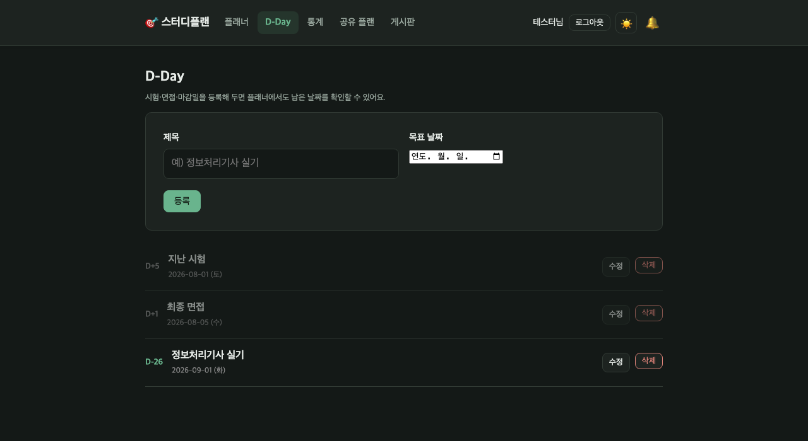

# study-board - 스터디 플래너 + 게시판

Java 17 / Spring Boot 3.3 / Thymeleaf / H2(파일) / JWT 인증 기반의
스터디 플래너·게시판 프로젝트입니다.

## 기능

- **회원/인증**: 회원가입(BCrypt), JWT 로그인(HttpOnly + SameSite=Lax 쿠키),
  리프레시 토큰 기반 자동 갱신 + 로그아웃 즉시 무효화
- **알림 설정**: 리마인더를 몇 분 전에 받을지(0~60분), 공유·댓글 알림을 받을지 각각 켜고 끌 수 있다
- **마이페이지**: 닉네임·이메일·하루 목표 시간 수정, 비밀번호 변경(전 기기 로그아웃), 회원 탈퇴.
  탈퇴하면 개인 학습 데이터는 삭제되고 게시글·댓글은 `탈퇴한 회원` 으로 남는다
- **비밀번호 찾기**: 이메일로 30분짜리 재설정 링크 발송. 메일을 실제로 보내지 않고
  **콘솔 로그에 링크를 출력**하므로 SMTP 계정 없이 바로 써 볼 수 있다 (`LoggingMailSender`)
- **소개 화면**: 비로그인으로 접속하면 무엇을 하는 서비스인지 보여 주는 랜딩 페이지
- **첫 사용 안내**: 가입 직후 3단계(목표일 → 오늘 계획 → 타이머 체험)로 3분 안에 첫 기록까지 안내.
  언제든 건너뛸 수 있고, 도중에 나갔다 와도 하던 단계에서 이어진다
- **홈 대시보드**: 오늘 목표 진행률 링, 연속 달성일, 다음 할 일(바로 타이머 시작), 남은 일정, 이번 주 추이
- **빠른 일정 입력**: 일간 뷰에서 한 줄만 적으면 바로 등록. 완료 체크도 화면 새로고침 없이 처리되고,
  어제 못 끝낸 일정은 한 번에 오늘로 가져올 수 있다
- **일정 검색**: 키워드·분류·완료 여부·기간을 조합해 찾기. 반복 일정이 쌓여도 원하는 것만 골라낼 수 있다
- **모바일**: 좁은 화면에서는 하단 탭바로 이동하고, 주간 뷰는 7열을 유지한 채 가로로 스크롤된다
- **플래너**: 일간/주간/월간 뷰 (로그인 회원 본인 것만), 완료 토글,
  분류(코딩테스트·자소서·면접 등), 반복 일정(매일/평일/매주)
- **스터디 그룹**: 초대 코드로 모이는 소규모 모임. 그룹장이 나가면 가장 오래된 멤버가 이어받고,
  혼자 남았으면 그룹째 사라진다. 상세 화면은 초대 코드가 실리므로 멤버만 볼 수 있다
- **공유 범위 3단계**: 비공개 / 그룹 공개 / 전체 공개.
  그룹 공개 플랜은 같은 그룹 사람에게만 목록·상세·댓글이 열리고, 공유 알림도 그 사람들에게만 간다
- **학습 타이머**: 계획을 실행할 때 시작/종료를 눌러 **실제 공부한 시간**을 기록.
  헤더 배지가 페이지를 옮겨도 계속 돌고, 켜둔 채 잊은 세션은 자동으로 정리된다 (나중에 직접 보정 가능)
- **학습 통계**: 주간/월간 완료율, **실제 공부 시간과 계획 대비 실행률**, 연속 달성일,
  분류별 학습량, 일별 달성률 추이. 연속 달성일은 하루 목표 시간(기본 30분)을 실제로 채운 날만 센다
- **D-Day**: 시험·면접 등 목표일 카운트다운, 플래너 상단에 임박한 일정 요약
- **게시판**: CRUD + 검색(제목/제목+내용/작성자 닉네임) + 페이징, 읽기는 공개·쓰기는 로그인 필요.
  분류(자유/공고/후기/질문) 탭, 좋아요, 조회수, 마크다운 본문(렌더 후 허용 목록으로 살균해 XSS 차단)
- **그룹 랭킹·주간 챌린지**: 그룹 안에서 이번 주 학습 시간 순위를 보여 준다.
  목표는 각자의 하루 목표를 주간으로 환산해 판정하므로, 공부량이 다른 사람끼리 같은 잣대로 비교되지 않는다
- **회고**: 하루 한 줄 회고와 주간 회고. 숫자만으로는 알 수 없는 "왜 그랬는지" 를 남기고,
  주간 인증글 초안에 그대로 실린다
- **캘린더 연동**: 구독 주소(iCal)를 구글 캘린더에 등록하면 계획이 자동으로 따라온다. CSV 로 내려받아 엑셀에서 열 수도 있다
- **댓글·대댓글**: 게시글·공유 플랜 상세에 댓글/응원. **답글은 1단계까지**(답글에 답글을 달면 원댓글에 붙는다) —
  깊이를 열면 화면이 오른쪽으로 계속 밀린다. 스레드 단위로 페이징하므로 페이지 경계에서 스레드가 잘리지 않는다.
  본인 것만 수정·삭제할 수 있고, 고친 댓글에는 '수정됨' 이 붙는다 - 남이 읽은 뒤에 내용이 바뀔 수 있다면 그건 읽는 사람의 정보다
- **프로필 사진**: 댓글·그룹 멤버·순위표에 얼굴이 함께 보인다. 없으면 닉네임 첫 글자로 그리고 **요청을 보내지 않는다**
  (대부분 사진이 없는데 매번 404 를 받으면 목록 하나에 요청이 수십 번 나간다)
- **이메일 인증**: 주소가 실제로 닿는지 확인한다. 오타 난 주소는 비밀번호를 잊은 순간에야 문제가 되는데 그때는 고칠 방법이 없다.
  주소를 바꾸면 인증도 처음으로 돌아간다. 확인 링크는 로그인 없이 열린다(메일은 다른 기기에서 열린다)
- **소셜 로그인(선택)**: 구글·카카오. 자격증명이 없으면 기능 자체가 붙지 않고 로그인 화면에도 나오지 않는다.
  성공하면 평소와 같은 JWT 쿠키를 발급하므로 그 이후의 코드는 어디로 들어왔는지 몰라도 된다
- **소유권**: 본인 글/플랜/댓글만 수정·삭제 가능 (타인 접근 시 403)
- **사용자별 실시간 알림**: SSE 기반. 리마인더는 본인에게, 댓글은 대상 글/플랜 작성자에게 (셀프 댓글 제외),
  플랜 공유는 **범위에 따라** 전체 또는 같은 그룹 사람에게만.
  연결이 끊겼다 돌아오면 놓친 알림을 이어서 받음
- **주간 인증글**: 주간 뷰에서 한 주 학습 기록을 게시글 초안으로 옮겨 인증글 작성
- **파일 업로드**: 다중 업로드(글당 10개, 파일당 10MB), 확장자 화이트리스트 검증,
  **이미지는 파일 내용(매직 넘버)까지 확인**해 형식을 정한다 - 확장자와 Content-Type 은 올리는 쪽이
  정하는 값이라, 인라인으로 서빙되는 이미지는 그 주장만 믿을 수 없다.
  이미지만 인라인 미리보기·그 외는 강제 다운로드 (XSS 방지)

- **알림 전체 보기**: 벨 패널은 최근 10건이고, 그 뒤로 밀려난 알림은 `/notifications/all` 에서 본다.
  읽음 처리는 알림 하나 단위다(패널을 열었다는 사실이 읽음을 정하지 않는다).
  '모두 읽음' 과 '모두 삭제' 를 따로 둔다. 읽은 알림은 90일, 그 밖은 180일 뒤 자동 정리
- **글쓰기 보조**: 마크다운 미리보기(서버의 렌더러를 그대로 부르므로 결과가 실제와 같다),
  브라우저에 임시 저장(쓰다 만 글을 다시 열 때 물어보고 되살린다)
- **모아보기**: 내가 쓴 글 / 좋아요한 글 (`/posts/mine`)
- **그룹 관리**: 그룹장은 이름·소개를 고치고, 초대 코드를 재발급하고, 멤버를 내보낼 수 있다

## 화면

| 플래너 (일간) | 학습 통계 
|---|---|
|  |  |
| D-Day 요약, 분류 배지, 완료 토글 | 완료율·공부 시간·연속 달성, 일별/분류별 집계 |

| 주간 인증글 + 댓글 | D-Day |
|---|---|
|  |  |
| 한 주 학습 기록을 초안으로 자동 생성 | 목표일 카운트다운 (D-n / D-DAY / D+n) |

## 소셜 로그인 켜기 (선택)

기본은 꺼져 있다. 자격증명이 없으면 `ClientRegistrationRepository` 빈이 만들어지지 않고,
`SecurityConfig` 가 `oauth2Login` 을 아예 붙이지 않으며, 로그인 화면에도 버튼이 나오지 않는다.

```bash
SPRING_PROFILES_ACTIVE=oauth \
GOOGLE_CLIENT_ID=... GOOGLE_CLIENT_SECRET=... \
KAKAO_CLIENT_ID=...  KAKAO_CLIENT_SECRET=... \
./gradlew bootRun
```

각 콘솔에 등록할 리디렉션 주소:

| 제공자 | 콘솔 | Redirect URI |
|---|---|---|
| 구글 | console.cloud.google.com | `{app.base-url}/login/oauth2/code/google` |
| 카카오 | developers.kakao.com | `{app.base-url}/login/oauth2/code/kakao` |

둘 중 하나만 쓸 거라면 `application-oauth.yml` 에서 나머지 `registration` 블록을 지우면 된다.
카카오는 이메일이 동의 항목이라, 사용자가 거부하면 이메일 없는 계정으로 만들어진다.

## 검색 성능 (PostgreSQL)

검색은 `like '%키워드%'` 라 앞 와일드카드 때문에 B-tree 를 못 쓴다.
흔한 처방인 전문검색(`to_tsvector`)을 쓰지 <b>않는</b> 이유는 본문이 한국어이기 때문이다 —
기본 설정은 형태소를 모르고 공백으로만 잘라, "코딩테스트" 를 "코테" 로 찾을 수 없게 된다(지금보다 나빠진다).

대신 `pg_trgm` 의 GIN 인덱스를 둔다(`db/vendor/postgresql/V28`). **쿼리를 그대로 둔 채** 가속하므로
애플리케이션 코드는 한 줄도 바뀌지 않는다. H2 는 로컬 개발용이라 인덱스 없이 순차 검색으로 충분하다.

## 정기 정리 작업

새벽에 몰아서 돈다. 지우는 규칙은 각 스케줄러 안에 상수로 적혀 있다 -
"언제부터 사라지는가" 는 정책이고, 정책은 그것을 실행하는 자리에 있어야 나중에 찾을 수 있다.

| 시각 | 하는 일 |
|---|---|
| 04:00 | 만료된 리프레시 토큰 정리 |
| 04:10 | 만료된 비밀번호 재설정 토큰 정리 |
| 04:15 | 만료된 이메일 인증 토큰 정리 |
| 04:20 | 오래된 알림 정리 (읽음 90일 / 그 밖 180일) |
| 04:40 | 어느 글도 참조하지 않는 업로드 파일 정리 (24시간 유예) |

## 운영 주의 사항

- **h2-console 은 기본으로 꺼져 있다.** 로컬에서 필요하면 `H2_CONSOLE_ENABLED=true` 로 켠다.
  켤 때만 보안 예외가 함께 생기므로, 끄면 예외도 사라진다
- **JWT_SECRET 은 반드시 환경변수로 교체한다** (기본값은 로컬 개발용)
- 컨테이너로 띄울 때 `/app/data`(H2)·`/app/uploads`(첨부파일)에 볼륨을 붙이지 않으면
  컨테이너를 지울 때 데이터가 함께 사라진다

## 테스트

```bash
./gradlew test      # 단위·슬라이스 테스트 (빠름)
./gradlew e2eTest   # 실제 브라우저로 핵심 흐름 (처음 한 번 브라우저를 내려받는다)
```

E2E 는 기본 `test` 에서 빠져 있다. 브라우저를 내려받고 앱을 띄우느라 느려서,
섞어 두면 평소에 테스트를 돌리지 않게 되기 때문이다. CI 는 둘 다 돌린다.

## PostgreSQL 로 띄우기

로컬 개발은 H2 파일 DB 로 충분하지만, 운영과 같은 DB 에서 확인하고 싶을 때는

```bash
docker compose up --build
```

마이그레이션 중 DB 문법이 갈리는 것은 V11(진행 중 세션 유니크) 하나뿐이며,
`db/vendor/h2` 와 `db/vendor/postgresql` 로 나뉘어 있다(공통은 `db/migration`).
PostgreSQL 쪽이 실제로 도는지는 CI 가 매번 확인한다(`PostgresMigrationTest`).

## 실행 방법

```bash
./gradlew bootRun
```

> IDE(IntelliJ 등)에서 `BoardApplication` 을 직접 실행해도 됩니다.
> Gradle Wrapper가 없다면 프로젝트 루트에서 `gradle wrapper` 를 한 번 실행해 생성하세요.

### JDK 요구 사항

**JDK 17 이상이 필요합니다.** (Spring Boot 3 의 최소 요구 사항이자, Gradle 9 데몬의 요구 사항)

셸의 기본 JDK 가 17 미만이어도 `gradle/gradle-daemon-jvm.properties` 의
`toolchainVersion=17` 덕분에 Gradle 이 설치된 JDK 중 17 을 찾아 데몬을 띄웁니다.
그래도 실패한다면 이번 실행에만 JDK 를 지정해 보세요.

```bash
# macOS - 설치된 JDK 목록 확인
/usr/libexec/java_home -V

# 이번 실행에만 JDK 17 사용
JAVA_HOME=$(/usr/libexec/java_home -v 17) ./gradlew test
```

IntelliJ 를 쓴다면 `Settings → Build Tools → Gradle → Gradle JVM` 도 17 로 맞춰 주세요.

- 게시판: http://localhost:8080/posts
- H2 콘솔: http://localhost:8080/h2-console (JDBC URL: `jdbc:h2:file:./data/boarddb`, 사용자: `sa`)

## 파일 저장 위치

업로드 파일은 `~/board-uploads/` 에 UUID 파일명으로 저장되고, 원본 파일명은 DB에 보관됩니다.
경로는 `application.yml` 의 `file.upload-dir` 로 변경할 수 있습니다.

## 프로젝트 구조 (기능별 패키지)

```
src/main/java/com/example/board
├── BoardApplication.java
├── config/            # SecurityConfig(JWT·CSRF·경로 정책), JpaConfig, SchedulingConfig
├── common/            # GlobalExceptionHandler (404/403/500), web/PageBlock (페이지 번호 블록)
├── auth/              # JWT·리프레시 토큰(발급/회전/폐기), 인증 필터, 쿠키(AuthCookies), 로그인/로그아웃
├── member/            # Member 엔티티, 회원가입
├── post/              # 게시글 CRUD (목록은 PostSummary DTO 프로젝션)
├── plan/              # 플래너 (일간/주간/월간·공유 범위·리마인더 스케줄러)
├── group/             # 스터디 그룹 (초대 코드·그룹장 승계·탈퇴 정리)
├── retro/             # 회고 (하루 한 줄 / 주간, 주기별 길이·날짜 규칙은 RetroType)
├── calendar/          # 캘린더 내보내기 (iCal 구독·CSV, 외부 라이브러리 없음)
├── home/              # 소개 화면 + 홈 대시보드 (DashboardAssembler 가 여러 모듈을 읽기 전용으로 조합)
├── onboarding/        # 첫 사용 안내 3단계 (OnboardingProgress 가 단계를 계산)
├── mail/              # LoggingMailSender (재설정 링크를 콘솔에 출력 - SMTP 없이 전 과정 확인)
├── session/           # 학습 타이머 (실제 공부 시간 기록·방치 세션 자동 종료)
├── comment/           # 댓글 (게시글·공유 플랜 공용, CommentAddedEvent 발행)
├── stats/             # 학습 통계 (StudyStatistics·StudyStreak·GroupRanking 순수 계산 + 대시보드)
├── dday/              # D-Day 카운트다운
├── notification/      # 사용자별 SSE 실시간 알림 (recipient 기반)
└── file/              # FileStore(로컬 디스크, 확장자 화이트리스트), 파일 표시/다운로드

src/main/resources
├── application.yml
├── db/migration/      # Flyway (V1 init ~ V27 member_oauth)
├── db/vendor/{h2,postgresql}/  # DB 마다 문법이 갈리는 것만 (V11 부분 유니크, V28 검색 인덱스)
├── application-oauth.yml   # 소셜 로그인 (프로필 oauth 를 켤 때만)
├── static/css/        # tokens → components → layout → pages → responsive → a11y (순서가 곧 규칙)
├── static/js/
└── templates/{auth,posts,plans,fragments,error}
```

## 인증 방식

- 로그인 성공 시 두 개의 HttpOnly + SameSite=Lax 쿠키를 발급합니다.
  - `ACCESS_TOKEN`: JWT(HS256), 기본 15분. 무상태라 폐기할 수 없으므로 짧게 유지합니다.
  - `REFRESH_TOKEN`: 랜덤 토큰, 기본 14일. DB 에는 **SHA-256 해시만** 저장합니다.
- 액세스 토큰이 만료되면 `JwtAuthenticationFilter` 가 리프레시 토큰으로 자동 재발급합니다.
  SSR 이라 링크 이동마다 클라이언트가 갱신 요청을 보낼 수 없어 필터에서 처리합니다.
- 재발급 시 리프레시 토큰도 함께 **회전**되어, 한 번 쓴 토큰은 즉시 재사용할 수 없습니다.
- **로그아웃하면 리프레시 토큰 행을 삭제**해 즉시 무효화합니다.
  (이미 발급된 액세스 토큰은 무상태 특성상 최대 15분간 유효합니다.)
- 서버는 세션을 만들지 않으며(STATELESS), **CSRF 토큰은 세션 저장소(Spring Security 기본값)** 에 둡니다.
  쿠키 저장소는 한 요청 안에서 토큰이 두 번 만들어질 때 두 번째가 첫 번째를 보지 못해
  화면에 박힌 값과 쿠키가 갈립니다(→ 403). JS 는 헤더 프래그먼트의 `data-csrf-*` 에서
  토큰 이름과 값을 함께 읽으므로 저장소가 무엇이든 따라옵니다.
- 시크릿은 `jwt.secret`(환경변수 `JWT_SECRET`)로 주입하며 운영 환경에서는 반드시 교체하세요.
- 만료된 리프레시 토큰은 매일 04시 스케줄러가 정리합니다.

## 참고

- H2 파일 DB(`./data/boarddb`)를 사용하므로 재시작해도 데이터가 유지됩니다.
- 스키마는 Flyway 마이그레이션(`src/main/resources/db/migration`)으로 관리하고
  `ddl-auto: validate` 로 엔티티-스키마 일치를 검증합니다. 스키마 변경 시 새 `V{n}__*.sql` 을 추가하세요.
- 파일 저장을 S3 등으로 옮기려면 `FileStore` 만 구현체를 바꾸면 됩니다.
# study-board
